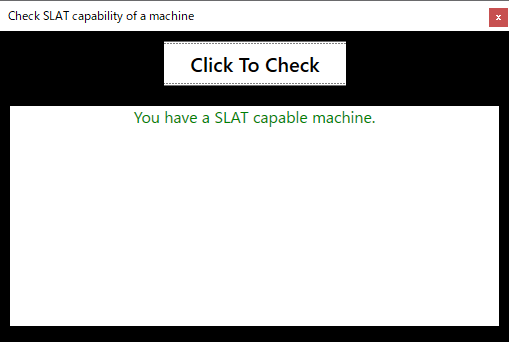

# MachineSLATStatusCheck
Check Processor SLAT (Second Level Address Translation) feature available or not (in C#)
based on Codeplex project "MachineSLATStatusCheck"
https://archive.codeplex.com/?p=slatstatuscheck

# Original Explanation
This <Tool> checks whether a machine is SLAT capable to run HYPER-V client or not. Also this takes care of whether Windows Phone 8 Emulator or not.

# Test
This project appears used to build by Visual Studio 2010. But I have no such build emvironment in handy, never checked whether this can be build by original development environment.
Then, I tried Visual Studio 2019 Version 16.9.2 build and this went very well. The result executable showed below result in AMD Ryzen 7 3750H development PC.

